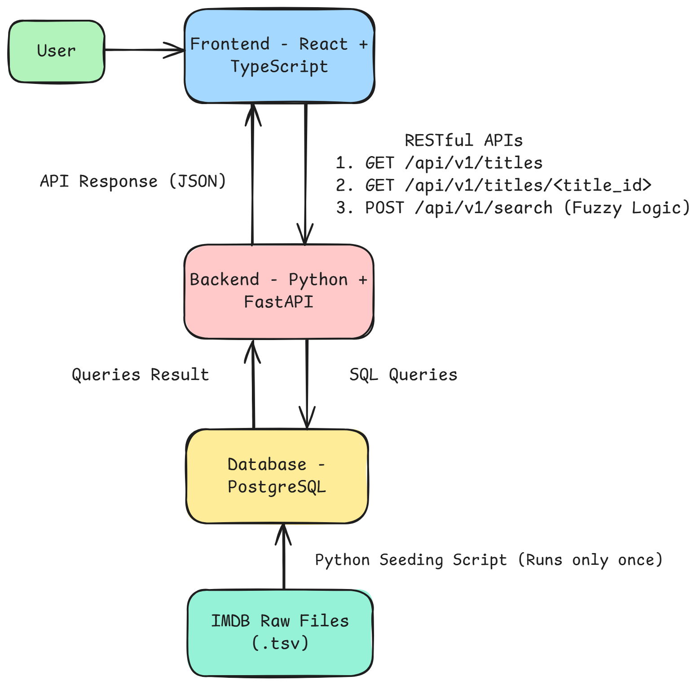

# Cageflix Backend - FastAPI + PostgreSQL

A scalable backend service for Cageflix – a Netflix-style movie library focused exclusively on Nicolas Cage’s filmography.  
Built with FastAPI, async SQLAlchemy, and PostgreSQL. Handles data extraction, search (including fuzzy search), and provide robust RESTful APIs.

---

## Table of Contents

- [Technology Choices & Rationale](#technology-choices--rationale)
- [Architecture Diagram](#architecture-diagram)
- [Database Schema](#database-schema)
- [Dataset Sources](#dataset-sources)
- [Setup Instructions](#setup-instructions)
- [API Endpoints](#api-endpoints)
- [Known Issues & Dataset Constraints](#known-issues--dataset-constraints)
- [Future Enhancements](#future-enhancements)

---

## Technology Choices & Rationale

| Technology           | Reasoning                                                               |
|----------------------|-------------------------------------------------------------------------|
| FastAPI              | Modern, async, fast, and type-safe                                      |
| Async SQLAlchemy     | Non-blocking DB access                                                  |
| Databases            | Simple async queries on top of SQLAlchemy Core                          |
| Pandas               | Data cleaning and transformation for ETL                                |
| PostgreSQL           | Robust, open-source RDBMS with full-text and JSON support               |
| Railway              | Managed deployment                                                      |
| RapidFuzz            | Fast, accurate fuzzy string matching in Python                          |

---

### Architecture Diagram

  

---

### Project Structure & Purpose

CAGEFLIX-BACKEND/
│
│ 
├── app/                                # Main application package
│   ├── models/                         # Pydantic data models and schemas
│   ├── routers/                        # FastAPI route definitions (API endpoints)
│   │   ├── search.py                   # /search endpoint – fuzzy search API
│   │   └── titles.py                   # /titles endpoints – all titles, single title
│   ├── services/                       # Business logic, DB operations, helpers
│   │   ├── helper.py                   # helper functions 
│   │   └── search.py                   # fuzzy search queries
│   │   └── titles.py                   # titles queries
│   ├── __init__.py
│   ├── config.py                       # ENV configuration
│   ├── database.py                     # Database setup and schema creation
│   ├── extract_cageflix_data.py        # Extract IMDB dataset
│   ├── logging_conf.py                 # Logging configuration and setup
│   ├── main.py                         # FastAPI app factory, entrypoint
│   └── utils.py                        # Utility/helper functions
│
├── data/
│   └── db_dump.sql                     # Prebuilt SQL dump 
|
├── docs/
│   └── architecture.png                # Application architecture diagram
|    
├── .env.example                        # Example environment variable file for config
├── .gitignore                          # Git ignore rules (e.g. env, pycache)
├── Procfile                            # Railway (or Heroku) process runner definition
├── README.md                           # Full project documentation (setup, usage, API, etc)
├── requirements.txt                    # Python dependencies list for pip install

---

## Database Schema

Schema Overview:

- **titles**
    - tconst (PK): Unique ID for each title (movie/show)
    - titleType, primaryTitle, originalTitle, isAdult, startYear, endYear, runtimeMinutes, genres
- **persons**
    - nconst (PK): Unique ID for each person
    - primaryName, birthYear, deathYear, primaryProfession
- **cast**
    - tconst (PK, FK → titles.tconst): Title foreign key  
    - nconst (PK, FK → persons.nconst): Person foreign key  
    - category, job, characters  
    - Join table: Models the many-to-many relationship between titles and persons
- **ratings**
    - tconst (PK, FK → titles.tconst): Title foreign key  
    - averageRating, numVotes  
    - One-to-one with titles (each title can have one rating)

---

## Dataset Sources

[All data is sourced from the official IMDb non-commercial datasets:](https://developer.imdb.com/non-commercial-datasets/)

- IMDb Datasets Overview:
    - title.basics.tsv.gz (title info):
    - title.ratings.tsv.gz (ratings/votes):
    - title.principals.tsv.gz (main cast/crew): 
    - name.basics.tsv.gz (person data):

All data extraction from IMDB dataset is handled in `app/extract_cageflix_data.py`.  
Note: Only Nicolas Cage-related titles and their associated cast are included in the final database.

---

## Setup Instructions

1. Clone the Repository

    git clone https://github.com/yourusername/cageflix-backend.git  
    cd cageflix-backend

2. Create and Configure Environment

    python -m venv .venv  
    source .venv/bin/activate           # On Windows: .venv\Scripts\activate  
    pip install -r requirements.txt

    Ensure PostgreSQL is running and accessible according to your .env settings.  
    If needed, create the database manually using db_dump file provided in data folder or via included scripts.

3. Start the Application

    Initial data ingestion happens automatically on first app run if the DB is empty:
    To run application locally: uvicorn app.main:app

---

## API Endpoints

- GET /titles – List titles (with pagination)
- GET /titles/{title_id} – Get detailed info about a title
- GET /search – Fuzzy search based on titles, genres, cast

---

## Known Issues & Dataset Constraints

- IMDb dataset does not include description or images; these fields are missing from the dataset.
- Many columns (e.g., co-star names, ratings, number of votes) contain null or empty values.

---

## Future Enhancements

- Switch to Polars for data extraction:  
  Replace Pandas with Polars for faster, memory-efficient data processing.

- Full fuzzy search:  
  Expand and optimize fuzzy search.

- User authentication & authorization:  
  Secure endpoints, enable user favorites, reviews, etc.

---
